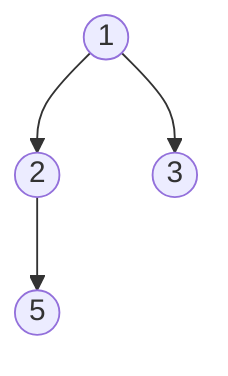

 Binary Trees are a different data structure and allow hierarchical organisation and structure of multi-level sequences. This resembles a tree with branching at each node expanding the tree in a non-linear fashion.

It consists of nodes, where each node can have at most two children nodes, known as the left child and the right child. 
![[Pasted image 20260612171156.png]]

- **Root node :** Top most node of a binary tree from which all nodes stem out. 
- **Children node :** Nodes are directly connected to a parent node. 
- **Leaf node :** Nodes that does not have children
- **Ancestors :** Nodes that lie on the path from a particular node to the root node. They are the nodes encountered while moving upwards from a specific node through its parent nodes until reaching the root of the tree.

### Types of binary trees
- **Full Binary Tress** - Every node will either have 0 or 2 children. 
- **Complete Binary Tree** - All levels are completely filled except the last level. The last level has all nodes filled from left to right. 
![[Pasted image 20260612172322.png]]
In a complete binary tree, all leaf nodes are in the last level or the second-to-last level, and they are positioned towards the leftmost side.
![[Pasted image 20260612172730.png]]

- **Perfect Binary Tree** - All left nodes are at the same level. 
- **Balanced Binary Tree** - Height of tree at max can be $log(N)$
- **Degenerate Tree** - nodes are arranged in a single path leaning to the right or left. The tree resembles a linked list in its structure where each node points to the next node in a linear fashion.

![[Pasted image 20260612173115.png]]

### Binary Tree in C++
So for the representation of the binary tree node is done with the help of a struct.  
```cpp
struct Node {
   int data;
   struct Node* left;
   struct Node* right;
   
   Node (int val){
      data = val;
      left = right = null;
   }
}
```

So in main we can define the binary tree as follows :
```cpp
main(){
   struct Node* root = new Node(1);
   root -> left = new Node(2);
   root -> right = new Node(3);
   root -> left -> right = new Node(5);
}
```



Now let us see how we can traverse through a tree by [[preorder-inorder-postorder traversal| Preorder, Inorder and Postorder Traversal]]  

