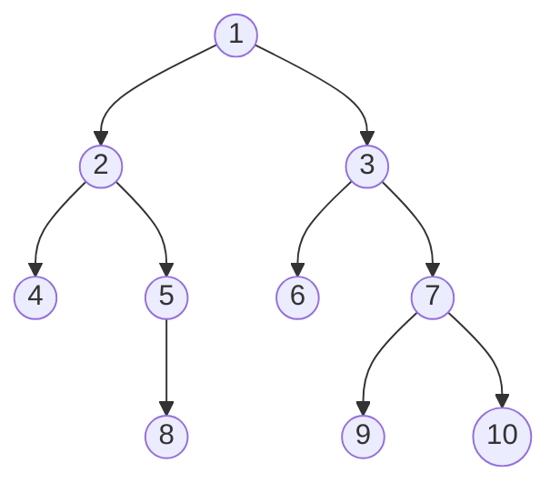
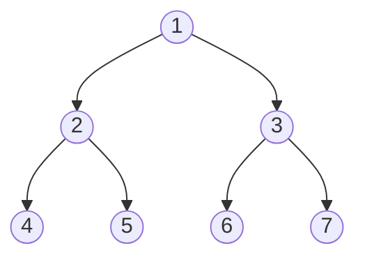

In order to traverse through a tree there are several techniques such as `BFS` - Breadth First Search and `DFS` - Depth First Search. 

There are three types of `DFS` techniques
- Inorder Traversal (Left + Root + Right)
- Pre-order Traversal (Root + Left + Right)
- Post-order Traversal (Left + Right + Root)

In `BFS` Traversal we go level by level finding the value of the tree. 

Let us take an example and write the sequence in which we will see the values in our traversal

- In `BFS` traversal : `1, 2, 3, 4, 5, 6, 7, 8, 9, 10`. We go level wise from left to right
- In `Inorder` traversal : `4, 2, 8, 5, 1, 6, 3, 9, 7, 10`
- In `Preorder` traversal : `1, 2, 4, 5, 8, 3, 6, 7, 9, 10`
- In `Postorder` traversal : `4, 8, 5, 2, 6, 9, 10, 7, 3, 1`

### Pre-order Traversal 
(Root - Left - Right)
There are several ways of implementing this in code. First we will look at the recursive approach
```cpp
void preorder(node* root) {
   if(node == null) return;
   
   print(node -> data)
   preorder(node->left)
   preorder(node->right)
}
```
Here the Time Complexity is $\text{O(N)}$, where $N$ is the number of nodes. For the Space Complexity is the height of the tree, which in the worst case if it is a skewed tree would be $\text{O(N)}$. 

Now let us look at the Iterative approach for this :
```cpp
vector<int> preorder(node* root) {
    vector<int> ans;
    if(root == NULL) return ans;
    
    stack<node*> st;
    st.push(root);
    if(!st.empty()) {
       root = st.top();
       st.pop();
       ans.push_back(root->val);
       if(root->right != NULL){
          st.push(root->right);
       }
       if(root->left != NULL){
          st.push(root->left);
       }
    }
    return ans;
}
```
The time and space complexity is $\text{O(N)}$.

### Inorder Traversal
(Left - Root - Right)
The recursive method of implementing this is as follows :
```cpp
void inorder(node* root) {
   if(node == null) return;
   
   inorder(node->left);
   print(node->data);
   inorder(node->right);
}
```
Here similar to `Preorder Traversal` the time complexity and space complexity are $\text{O(N)}$.

Now let us look at the iterative approach for this :
```cpp
vector<int> inorder(node* root){
   vector<int> ans;
   if(root == NULL) return ans;
   stack <node*> st;
   
   while(true) {
      if(node != NULL) {
         st.push(node);
         node = node->left;
      }
      else{
         if(st.empty() == true) break;
         node = st.top();
         st.pop();
         ans.push_back(node->val);
         node = node->right;
      }
   }
   return ans;
}
```
Here the time and space complexity is $\text{O(N)}$.

### Postorder Traversal
(Left - Right - Root)
The recursive method of implementing this is as follows :
```cpp
void postorder(node* root) {
   if(node == null) return;
   
   postorder(node -> left);
   postorder(node -> right);
   print(node -> data);
}
```
The time and space complexity is $\text{O(N)}$. 

Now let us look at the iterative approach using 2 stack for this :
```cpp
vector<int> postorder(node* root){
   vector<int> ans;
   if(root == NULL) return ans;
   stack<node*> st1, st2;
   st1.push(root);
   
   while(!st1.empty()) {
      root = st1.top();
      st1.pop();
      st2.push(root);
      if(root->left != NULL) {
         st1.push(root->left);
      }
      if(root->right != NULL) {
         st1.push(root->right);
      }
   }
   
   while(!st2.empty()) {
      ans.push_back(st2.top() -> data);
      st2.pop();
   }
   
   return ans;
}
```
Here the time complexity is $\text{O(N)}$ and space complexity is $\text{O(2N)}$.

### BFS Traversal 
(Level order traversal)
This implementation of `BFS` uses queues and vectors. Let us understand the implementation from an example.

We put the first node in the queue. For this node we check it anything is there on its left, if yes then we push its data in the queue as well. Similarly we check if any thing is there in the right, if yes then its data is pushed in the queue. Then this node for which we check the left and right for is removed from the queue and pushed vector as an vector. Then for the rest of the element of the queue same procedure is done and it is pushed into a vector of vectors. 

```cpp 
vector<vector<int>> bfs(node* root) {
   vector<vector<int>> ans;
   if(root == NULL) return ans;
   queue<node*> q;
   q.push(root);
   
   while(!q.empty()) {
      int size = q.size();
      vector<int> level;
      for(int i = 0; i<size; i++){
         node* top = q.front();
         if(node -> left != NULL) q.push(node -> left);
         if(node -> right != NULL) q.push(node -> right);
         level.push_back(node -> data);
      }
      ans.push_back(level);
   }
   return ans;
} 
```
The time complexity is $\text{O(N)}$ and the space complexity is $\text{O(N)}$. 

